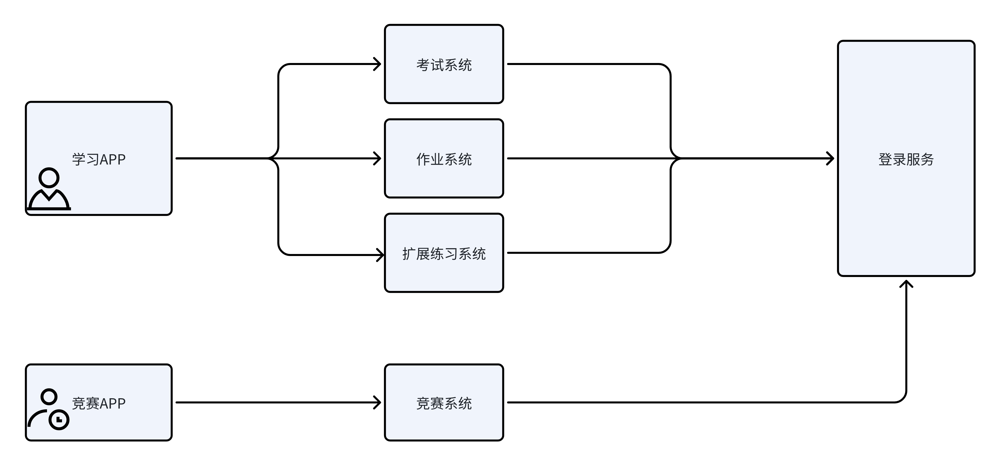
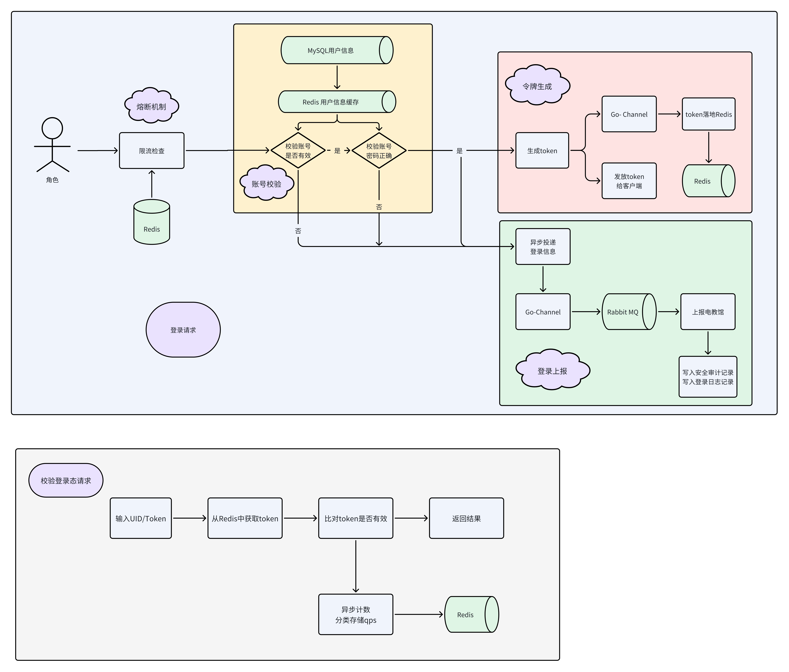
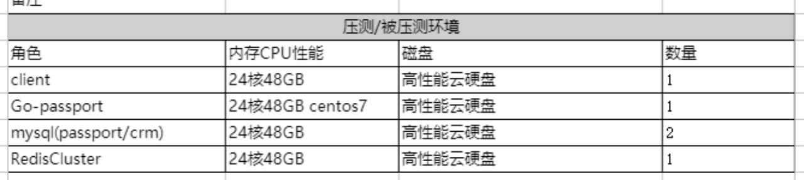
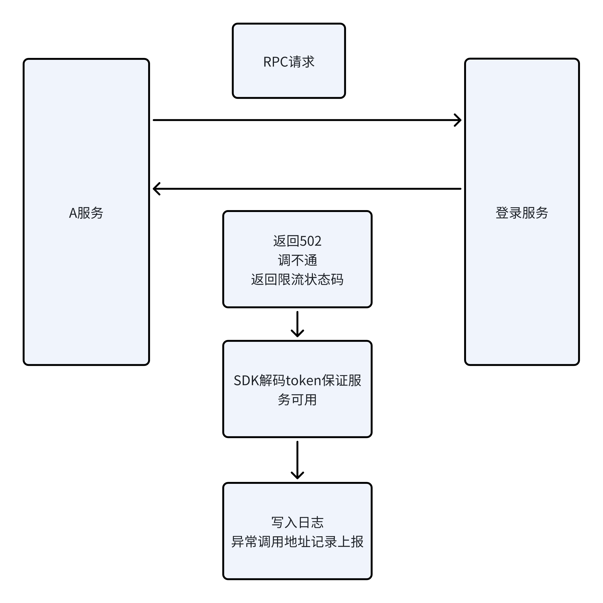
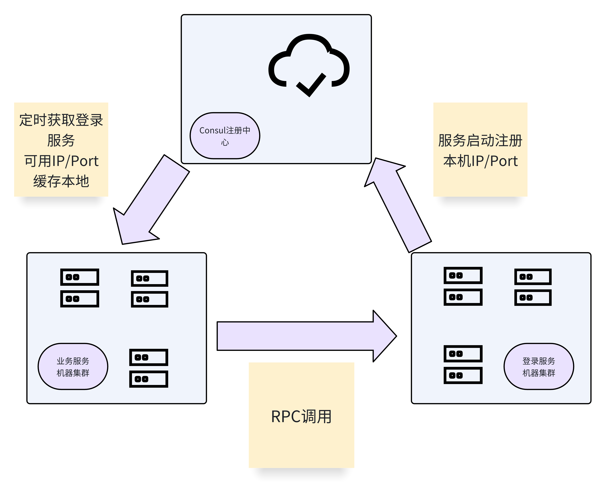

# 项目起因

## 业务背景

-   因寒暑假定期线下推广优化，流量高涨。目前业务产品在每年新学期开学会有大批新用户使用，形成流量高峰。
-   目前用户量在千万级别，日活百万用户。用户群体主要为学生。
-   因主要使用场景为学生放学同步学习，每天流量集中在晚7点 ～ 9点。
-   目前流量已超过系统负载瓶颈，出现多次系统502事故，其中流量承载量最大的是登录服务。

## **全站核心服务架构图**



## 现状

-   登录是全站核心服务。各产品线应用发起的http请求量中，依赖登录服务的请求占全站总请求量的90% （服务重要性）
-   登录服务目前可支撑的并发量低。线上扩容20台机器，压测到tps只有5.4k。达不到每年开学高峰期，用户流量高涨时，高并发稳定性要求。（性能差）
-   登录服务出故障，全站产品线业务都将无法服务。（影响范围广）
-   登录服务，对外提供IP/端口裸地址调用。线上扩容后，需要为各个调用方RPC配置文件添加上登录服务新扩容机器的ip/端口地址。 (可扩展性差)
-   登陆服务使用PHP-FPM架构，硬件资源利用效能差，很高的服务器硬件配置，跑不出更高的性能。(资源利用率低)

  


> PS: 登录服务业界也叫passport服务，本文有些地方会混用这两个名词

  


## 目标

-   用更少的硬件成本，实现能满足10w用户并发登录的高性能登录系统。并发翻10倍，成本减半。
-   对现有依赖登录服务业务，做弱化处理，达到上游调用方平滑接入。

  


# 系统分析

## 登录服务核心流程


> 登录服务的核心功能：就是发放令牌，再通过校验令牌，确认用户请求的登录态是否有效

-   因为我们是教育产品，登录之后，还需要向电教馆等系统上报信息。并且写入一系列记录用于安全审计。
-   因为业务需要，我们需要允许多端登录，并且需要有踢用户下线，封禁账号功能。所以token必须落库，不能使用jwt模式

  


## 服务瓶颈

### 业务流程问题

#### 账号校验流程

账号校验流程中。需要向用户表获取用户信息。用户表设计糅合了多个产品线业务字段。

曾出现因竞赛系统举行竞赛期间，人工导入的用户登录后，集中补充实名数据。用户表短时间内集中批量写，出现间隙锁，导致其他应用登录时，读取用户表，出现慢查询。

#### 令牌生成流程

token生成使用哈希算法，token中无法解码出用户基础信息。容错性差，无法在登录服务无法服务时，做系统降级设计。

#### 登录上报流程

登录上报是非核心流程。并且依赖外部系统电教馆。使用同步模式，会降低登录接口响应时间和接口可靠性。

### 性能问题

#### DB性能问题

MySQL无法承载登录峰值的写流量。用户token表使用memory引擎，memory引擎读取速度快。写入时使用表锁，数据不可靠。

#### PHP-FPM性能问题

由于PHP- FPM没有DB长连接机制，高并发模式下，频繁创建连接，导致web应用服务器吞吐能力不足。

频繁创建短连接导致MySQL access buff 不够用。出现大量连接失败。对外体现接口出现502

因瓶颈在连接数不够用，无法通过调高FPM-worker配置来提升单机吞吐，压测tps到20机5.4k时，扩容收效不大，且反而造成MySQL压力瓶颈。

因此，PHP单机性能无法跑满，硬件资源利用率低。

### 架构问题

#### RPC调用

-   服务间RPC调用没有标记调用者来源，登录服务无法明确请求来源上游调用方。难以做限流熔断，错误处理机制。
-   服务间RPC调用，通过内网ip/port裸地址调用。如果流量高涨，线上扩容登录服务，运维需要修改各个调用方配置，添加扩容增加的登录服务ip地址。运维困难，操作繁琐，耗时长，且不可靠。

#### 服务设计

-   登录服务作为最基础服务，没有限流熔断机制。对流量高涨时，没有考虑到本服务自我保护机制。
-   一旦登录服务出现故障，全站所有产品线都将出现异常不可使用。从全站系统可用性角度，没有一个合理的降级容错机制。

  


# 服务优化

## 业务流程优化

-   保证核心服务单一原则，裁剪无关业务流程。

    -   用户表垂直分表，将原有用户表中跟各产品线相关字段，例如学校。用户实名，用户昵称等字段拆离到用户扩展信息表。
    -   用户表，只保持登录业务相关字段 。`uid`,`uname`,`pwd` ,`phone`,`status`,`deleted`

  


## 高性能优化

### 设计原则

-   保证登录核心流程中的读写操作，都落于Redis。Redis读写速度是MySQL10～100倍 ，能承载的并发压力更高
-   非登录核心流程，使用异步写队列。不阻塞登录主流程，减少登录接口响应时间

  


### 流程实现



-   账号校验流程。使用Redis缓存用户信息提升读请求性能
-   令牌生成流程。利用Go-Channel异步落地token信息，提升写请求响应。使用Redis存储token信息，提升校验登录态读token性能
-   登录上报流程。利用Go-Channel异步落地登录信息到RabbitMQ中。使用RabbitMQ解耦登录上报流程，异步上报登录信息。

  


> 使用Redis解决流量高涨带来的DB瓶颈。提高服务吞吐量
>
> 使用RabbitMQ异步非核心流程，提升接口响应时间，减少外部依赖，提高服务稳定性。
>
> 利用Go语言连接池机制，解决PHP高并发下短连接，连接数不够问题。利用Go语言channel特性，优化异步写流量，提升响应时间。channel也起到部分削峰作用，减少DB层压力

  


### 性能压测

#### 旧服务压测指标


  


#### 新服务压测指标




  


## 高可用优化

> 我们在做高可用优化的前提，就是先统一了登录服务的调用SDK。
>
> 由登录服务研发封装一个登录服务调用的基础类库。全站所有服务，对登录服务的调用，都必须用这个类库来发起。
>
> 这样做的好处是，我们可以在登录sdk里通过读取配置在发起RPC调用时统一给各调用方添加来源标识，统一做降级处理。做服务发现远程调用地址缓存。

  


### RPC调用者标识

-   我们在向登录服务发起RPC请求时，在类库中统一添加两个字段 `appFrom`,`consumer`
-   appFrom来源于对应app产品线发起方，http请求header携带，在RPC请求各个服务中透传，这个在我们做全链路压测改造时，已经预留。
-   consumer来源于调用服务。每个服务都有自己的调用标识配置。

  


### 限流熔断


#### 限流判断来源

-   我们在校验登录态时，异步记录接口调用信息
-   通过RPC调用者标记，分类汇总调用信息。将每个产品线的在线用户数，服务方调用QPS存储到Redis

#### 熔断规则

-   当产品线在线用户数超过对应限额时，不再允许新用户登录。保证在线用户正常使用。
-   当调用方QPS到达指定限额时，返回RPC限流状态码。保证服务自身可靠性。此时调用方请求处于部分可用。

  


### 服务降级



#### 降级实现

-   因为登录是核心服务，登录服务如果不可用，全站90%请求都要受影响。而且登录引入熔断自保护机制后。一旦登录服务熔断，上游服务如果没有合理的降级机制，将导致在线用户频繁掉线。
-   降级设计，将保证全站所有服务在登录服务不可用时，已登录用户不掉线，业务正常可用
-   上游服务通过登录sdk调用登录服务时，如果是检验登录态请求接口，并且登录服务不可用，会通过sdk解码token判断信息，验证token有效性，保证用户登录态校验功能正常。
-   降级功能，只支持检验登录态接口。也就是当登录服务不可用时，未在线用户无法再登录系统。

#### 令牌设计

-   将用户`uid`,`uname`,`phone`,`loginTime`,`vaildTime`等信息用`#` 号隔开组成一个字符串，作为一个明文令牌
-   加密得到密文令牌，为方便传输，将密文字符串做base64encode处理

#### 加密算法

出于性能考虑，令牌加密使用混淆机制

```

(1)将token字符串按字节异或一个魔数
 a^token^a  = token
也就是解码的时候，重新异或这个魔数可以得到这个token

(2)将token转成流,在特定位置插入一段随机字符，让整个token乱码
解码的时候，把对应的地方截掉
```

### 服务发现




-   我们做登录服务启动时，将本机内网IP/Port 注册到服务中心。
-   业务服务调用时，通过登录SDK从服务中心拉取，登录服务可用的IP/Port
-   当服务扩容时，上游服务，可以同步感知新扩容的机器。无需运维手动修改上游服务配置文件

  


### 稳定性测试

#### 持续集成测试

使用gitlab+sonarQueue，提交代码时触发集成测试。保障接口的代码可靠性。

因为Go是强类型语言，PHP是弱类型语言。我们用interface去兼容PHP来源请求，所以使用的测试用例，需要保证覆盖的边界条件足够

#### 持续压力测试

虽然之前服务做过性能测试。但是，某段时间内的并发量、响应时间、错误率、资源饱和度。只能反应服务的高性能。

服务的高可用，还需关注持续稳定的服务时间。特别是对于Go语言这种静态语言，并且我们在项目中使用了协程，channel等特性，是否会有处理不当，导致服务运行一定时间后出现OOM之类问题。

所以，我们在上线前，用自研的压测系统，给测试环境登录服务10w QPS，让他持续压测几天。观察负载。错误率，业务日志。保障登录服务长期运行稳定性。

#### 混沌工程测试

之前压测的前提，都在于登录服务依赖的DB中间件正常工作。而实际上正式的生产环境，情况复杂。普通压力测试难以模拟上下游服务故障，包括mysql延时、mysql拒绝服务、redis、rabbitmq延时高、服务拒绝连接的故障、服务器内存高、cpu使用高、网络io高、磁盘io高的故障。

PHP的FPM模式下，worker的处理不是常驻内存的。所以如果服务所在环境故障恢复后，PHP请求也会自动恢复。

Go是长驻内存服务，我们需要对这类情况进行模拟测试，才能明确下游故障恢复后，Go开发的登录服务，能否自动恢复正常。

这里，我们采用了基于阿里云echaos自研的混沌工程可视化测试系统，模拟下游服务故障，保障极端情况下登录服务的可用性

# 平滑接入

## 升级准备

-   升级上游服务，全部使用新版登录SDK调用旧登录服务。所有RPC请求全部携带调用方请求标记
-   将RPC调用协议的序列化配置全部修改成Json，登录SDK默认。避免序列化实现方式不同，导致Go解码Yar(PHP-RPC协议一种)序列化实现方式不同，出现请求异常

## 灰度发布

因为公司内部没有可用的流量灰度系统。而且本次优化，没有在原服务上改造。所以，灰度发布只能由业务实现。

> 实现思路：将新版登录服务，作为旧版登录服务的RPC透明代理上线。上线后，逐步调整流量灰度到所有流量都在新版登录服务处理。服务稳定运行后，下线旧登录系统


-   我们通过对用户UID取余的方式来保证单个用户的流量稳定落入新登录服务，或是旧登录服务
-   流量占比控制，写入配置文件。通过修改配置，调整灰度比，只到流量灰度到100%，下线旧登录服务

# 项目结果

-   提高服务吞吐量。将单机500 tps的登录服务，重构到单机3w tps。线上扩容能稳定压测到50w qps,P99线3ms，错误率0。
-   提高服务稳定性。重构后支持熔断降级，保障登录服务自身及其上游服务在极端情况核心功能正常服务
-   提高资源利用率。重构后，节省80%机器成本。
-   提高服务动态伸缩能力，减少运维人力成本。

# **Reference**

-   [知乎社区核心业务 Golang 化实践](https://mp.weixin.qq.com/s/K061RkO7szkYXs5eyEy8-g)
-   [滴滴passport设计之道:帐号体系高可用的7条经验(含PPT)](https://mp.weixin.qq.com/s?__biz=ugust=2019&mid=2653547482&idx=1&sn=13675fae5e037d720a9e9fb4a4861afd&scene=0#wechat_redirect)
-   [轻松筹1.6亿注册用户的Passport账户体系架构设计](https://juejin.im/entry/6844903486732124174)
-   [常见登录鉴权方案(360技术)](https://mp.weixin.qq.com/s/Stc_ZT95cluB3lfALZJP1A)
-   [你会做WEB上的用户登录功能吗？](https://coolshell.cn/articles/5353.html)
-   [使用Json Web Token设计Passport系统](https://www.cnblogs.com/binyue/p/4812798.html)
-   [设计一个可扩展的用户登录系统 (1)](https://www.liaoxuefeng.com/article/1029274073038464)
-   [单点登录（SSO）的设计与实现](https://ken.io/note/sso-design-implement)
-   [八幅漫画理解使用 JSON Web Token 设计单点登录系统](https://www.cnkirito.moe/jwt-learn-2/)
-   [基于token的多平台身份认证架构设计](https://cloud.tencent.com/developer/article/1014846)
-   [一种支持多端、多角色的用户体系设计](http://blog.caoxudong.info/blog/2019/04/24/passport_system_design)
-   [实现一个靠谱的Web认证](https://www.jianshu.com/p/805dc2a0f49e)
-   [HTTP API 认证授权术](https://coolshell.cn/articles/19395.html)
-   [挑战无处不在](https://coolshell.cn/articles/7048.html)
-   [CSDN明文口令泄露的启示](https://coolshell.cn/articles/6193.html)
-   [stackoverflow-如何实现登陆](https://stackoverflow.com/questions/549/the-definitive-guide-to-form-based-website-authentication#477579)
-   [如何设计安全的用户登录功能](https://my.oschina.net/u/1269381/blog/852679)
-   [用户帐号系统设计的原则有哪些？](https://www.zhihu.com/question/30362871)
-   [学习注册登录设计，这两篇就够了之第 01_02 篇(完结篇)](https://www.zcool.com.cn/article/ZODM0MDky.html)
-   [大型网站的用户登录系统是如何设计的? - 知乎](https://www.zhihu.com/question/25400195)